# Mawahib MVP Master Architecture Blueprint (Pre-Phase 3)

**Status:** Canonical architecture reference for remaining MVP → production scale  
**Date:** 2026-08-13  
**Supersedes for planning:** older phase ordering in `BACKEND_BLUEPRINT.md` where they conflict  
**Companion:** `ARCHITECTURE.md`, `AUTH.md` (UI), `DEV_SEED.md`, `SUPABASE_SECURITY.md`

> Stack (unchanged): React Native → NestJS → Services → Repository interfaces → Prisma → PostgreSQL (Supabase-hosted).  
> Supabase = Auth + Storage (+ optional Realtime later). **No domain CRUD from the mobile client via PostgREST.**

This document is design-only. It does not authorize migrations or controllers until Phase 3 implementation begins.

---

## 0. Executive verdict (summary)

| Question | Answer |
|----------|--------|
| Scale to large marketplace without major redesign? | **Yes** — layered Nest + Prisma + Auth/Storage separation is sound. |
| DB foundation sufficient for remaining MVP? | **Yes** — Phase 1–2 tables are correct building blocks. |
| Change anything before Phase 3? | **No blocking redesign.** Adopt the engagement model below as the contract before coding. |
| Implementation order optimal? | **Yes** (Jobs → Applications → Engagements → Messaging/Notifications → Payments → Reviews/Moderation). |
| This ER diagram canonical? | **Yes** — treat §11 as the database reference going forward. |
| Approve Phase 3 start? | **Approved** after this blueprint is accepted as the source of truth. |

---

## 1. Review of existing foundation (Phase 1–2)

### 1.1 What is solid (keep)

| Area | Assessment |
|------|------------|
| Request path | RN → Nest JWT → services → repos → Prisma only |
| Auth | Supabase Auth + Nest JWKS; `users.id` = `auth.users.id` |
| Bootstrap | Idempotent `POST /auth/bootstrap`; no Nest signup/login |
| Profiles | Additive phone + verification flags; no model split by account type |
| Portfolio / Services | Owner-scoped CRUD; visitor list APIs; packages/addons modeled correctly |
| Media | Nest-issued signed upload → complete → `ready`; private portfolio/services buckets |
| RLS | Domain tables revoked from PostgREST / locked down |
| Soft delete | Portfolio/services use `deleted_at` |
| Money | `numeric` + `SAR` on services |

### 1.2 Gaps that are acceptable until later phases

| Gap | Why OK | When |
|-----|--------|------|
| About sections (education/experience/certs/languages) still local on client | Not required for marketplace core | Profile completeness pass (with Phase 4–5 or parallel) |
| No public explore/search API | Jobs/engagements don’t need it first | Phase 3b / Phase 4 |
| Avatar as URL string vs `media_assets` FK | Works; denormalized public URL is fine for MVP | Beta: prefer `avatar_media_id` + URL cache |
| OTP/SMS deferred | Dev seed users exist; production auth hardening separate | Before public beta |
| `AccountType` enum only | Sufficient for talent/business MVP | Beta+: roles table for Admin/Moderator |

### 1.3 Decisions that must **not** be reversed

1. Never expose domain tables to the mobile Supabase client.  
2. Never create a second Nest user for phone.  
3. Never duplicate catalog write models for Talent/Service explore — they are **read projections**.  
4. Never store payment provider secrets in the app.  
5. Never use `user_metadata` for authorization.

### 1.4 Must change before Phase 3?

**None that require schema rewrites of Phase 1–2.**

**Contract decision (document, then implement in Phase 3):**

- Persist **absolute** `client_user_id` + `provider_user_id` on engagements (not view-relative `sent`/`received`).  
- Treat **JobListing**, **JobApplication**, **WorkRequest**, and **WorkEngagement** as distinct tables (not one overloaded `UserJob` table). Jobs inbox direction uses WorkRequest sender/recipient.

---

## 2. Domain design — remaining MVP modules

### 2.1 Marketplace

> **Canonical runtime contract:** `docs/MARKETPLACE_WORK_REQUESTS.md`  
> (supersedes the older “accept → in_progress” notes below where they conflict.)

#### Concepts

| Entity | Purpose |
|--------|---------|
| **JobListing** | Public demand post. Discoverable. **Any authenticated user** may post. |
| **JobApplication** | Link from applicant → listing (unique pair). Created with a WorkRequest. |
| **WorkRequest** | Unified Jobs inbox / negotiation entity for all three sources. |
| **WorkEngagement** | Commercial work record created **after agreement**, at `pending_payment`. |
| **EngagementEvent** / **WorkRequestEvent** | Append-only audit trails. |
| **EngagementDetail** / request terms JSON | Frozen snapshots of price/scope/package at request time. |

#### Hiring workflows (unified)

```text
Sources (all share the same WorkRequest lifecycle):
  A) Job posting application  — applicant = sender/provider; poster = recipient/client
  B) Service request          — requester = sender/client; service owner = recipient/provider
  C) Direct request           — requester = sender/client; target = recipient/provider

WorkRequest:
  pending
    → pending_payment | changes_requested | rejected | withdrawn
  changes_requested
    → pending_payment | rejected | withdrawn

On accept / accept-changes:
  WorkEngagement created at pending_payment (NOT in_progress)
  Listing is NOT auto-closed; other applicants are NOT auto-rejected

Phase 5 (future): pending_payment → in_progress after real payment
Then: in_progress → delivered → completed
```

**Sent / Received** is based only on `senderUserId` / `recipientUserId` (who initiated), never on client/provider.

#### Status machines (MVP)

**JobListing:** `draft → open → archived | closed | …` (manual close; multi-hire allowed)

**JobApplication:** stays in sync with the linked WorkRequest (`submitted` / `accepted` / `rejected` / `withdrawn`)

**WorkRequest:** see `MARKETPLACE_WORK_REQUESTS.md`

**WorkEngagement:** starts at `pending_payment` after agreement; API refuses client-driven `pending_payment → in_progress` until Phase 5 payments.

Rules:

- Only `client` pays; only `provider` delivers.  
- Direction (Sent/Received) ≠ commercial roles (client/provider).  
- Multiple accepted applicants per listing are allowed.  
- Closing a listing rejects open work requests; existing engagements continue.

#### Ownership

| Actor | Can |
|-------|-----|
| Any authenticated user | Create/publish own listings; manage own listings |
| Listing owner (recipient of applications) | Accept / request changes / reject applications |
| Work request sender | Withdraw (while pending/changes_requested); accept/decline proposed changes |
| Work request recipient | Accept / request changes / reject |
| Provider | Mark delivered (from in_progress) |
| System (Phase 5) | Payment webhook advances pending_payment → in_progress |

---

### 2.2 Messaging

| Entity | Purpose |
|--------|---------|
| **Conversation** | 1:1 thread (MVP); `type` for future group |
| **ConversationParticipant** | Membership, mute, last_read_at |
| **Message** | Append-only body + optional attachment media |
| **MessageAttachment** | FK to `media_assets` |

**Creation rules (MVP):**

1. Either party may open a conversation if they share an **active/requested engagement**, **or** are **connected** (when Connections ship), **or** listing owner ↔ applicant.  
2. Deduplicate 1:1 by sorted pair key `user_low_id:user_high_id`.  
3. No cold-message spam without connection/engagement (product rule).

**Read receipts:** `participants.last_read_at` + optional `messages.read_at` for sender-side ticks.  
**Typing:** Realtime channel later — not persisted.  
**Permissions:** Must be participant to read/write; blocked users cannot message.

---

### 2.3 Notifications

| Entity | Purpose |
|--------|---------|
| **Notification** | In-app inbox row |
| **DevicePushToken** | FCM/APNs tokens (later) |
| **NotificationPreference** | Per-type opt-in (later) |

**Types (enum, extensible):**  
`application_received`, `application_accepted`, `engagement_status`, `message_received`, `payment_received`, `review_received`, `connection_request`, `moderation_action`, `system`.

**Fields:** `recipient_id`, `actor_id?`, `type`, `title`, `body`, `payload jsonb` (deep link: `{ screen, params }`), `read_at`, `created_at`.

**Delivery:**

1. Write row in Nest (transactional outbox optional).  
2. Push via worker (Phase 4+).  
3. Realtime optional subscribe `user:{id}:notifications`.

**Batching:** Collapse message bursts (`3 new messages from X`) in worker — not in MVP v1.

---

### 2.4 Payments (provider-agnostic)

Never couple domain status to Stripe/HyperPay fields.

| Entity | Purpose |
|--------|---------|
| **PaymentIntent** | Attempt to collect funds for an engagement |
| **LedgerEntry** | Double-entry-ish audit of money movement |
| **EscrowHold** | Funds held pending release |
| **Payout** | Provider withdrawal |
| **Refund** | Reversal against a capture |
| **PaymentProviderEvent** | Raw webhook log (idempotent) |

**Statuses**

- Intent: `created → requires_action → processing → succeeded | failed | cancelled`  
- Escrow: `held → released | refunded | partially_released`  
- Payout: `requested → processing → paid | failed`  

**Provider adapter interface (Nest):**

```text
createCheckout(intent) → { redirectUrl | clientSecret }
handleWebhook(raw, headers) → normalized event
capture / refund / transfer — as providers allow
```

Adapters: Stripe | Moyasar | HyperPay | Tap | Custom — **same domain tables**.

**Currency:** SAR MVP; `currency char(3)` everywhere.

---

### 2.5 Reviews

| Entity | Purpose |
|--------|---------|
| **Review** | Rating + text after completed engagement |

Rules:

- One review per `(engagement_id, author_id)` unique.  
- Author must be client or provider on that engagement; subject is the counterpart.  
- Only when engagement `completed`.  
- Edit window e.g. 24–72h then lock.  
- Soft delete by author or hard-hide by moderation.  
- Update denormalized `users.rating_avg` / `rating_count` in service transaction.

---

### 2.6 Saved items

| Entity | Purpose |
|--------|---------|
| **SavedJob** | `(user_id, job_listing_id)` |
| **SavedService** | `(user_id, service_offering_id)` |
| **SavedTalent** | `(user_id, talent_user_id)` |

Unique pairs; cascade soft-hide when target deleted. Simple CRUD; no denorm required for MVP.

---

### 2.7 Reporting & moderation

| Entity | Purpose |
|--------|---------|
| **Report** | User/content report |
| **ModerationAction** | Admin decision log |

**Report:** `reporter_id`, `target_type` (user|post|service|portfolio|message|listing|review), `target_id`, `reason`, `details`, `status` (`open|triaging|actioned|dismissed`), timestamps.

**Actions:** warn, hide content, suspend user, ban, note — stored with `actor_admin_id`.

Admin UI later; APIs can be Nest-only with `admin` role.

---

### 2.8 Search

**MVP:** Postgres filters + indexes (`account_type`, skills join, city, service category, listing status).  
**Later:** materialized explore projections or OpenSearch/Meilisearch — **read models only**, Nest remains write authority.

Entities:

- `categories` / `tags` reference tables (admin-managed)  
- Soft refs: `service_offerings.category`, `job_listings.category_id`, `user_skills`

---

### 2.9 Admin panel (future product)

Capabilities (no implementation now):

- User management (verify, suspend, impersonation-disable)  
- Reports queue  
- Job/service/portfolio hide  
- Payment/escrow overrides (dual-control)  
- Analytics dashboards (read replicas)  
- System settings (feature flags, fee %)  

Authz: separate `admin` role + permission bits (see §7).

---

### 2.10 Social (post-MVP core path)

Posts/comments/likes remain Phase 6+ relative to marketplace. Schema reserved in ER diagram optional; do not block Phase 3.

Connections can ship with Messaging (Phase 4) as they gate cold outreach.

---

## 3. Database design conventions

Apply to all new tables:

| Convention | Rule |
|------------|------|
| PK | `uuid` |
| Timestamps | `created_at`, `updated_at` |
| Soft delete | `deleted_at` on user-generated content |
| Money | `numeric(12,2)` + `currency char(3)` |
| Ownership | Explicit `*_user_id` FKs; never infer from JWT alone in repos without check |
| Indexes | Status + owner + created_at; unique business keys |
| Audit | Engagement/payment/moderation: append-only event tables |
| Hard delete | Forbidden for rows with ledger/payment history |

### Scaling notes (design-time)

- Partition `messages` / `notifications` by time at ~high volume (later).  
- Denormalize counters on `users` / listings carefully with transactional updates.  
- Use `SKIP LOCKED` queues for outbox workers.  
- Read replicas for explore/search; primary for writes.

---

## 4. Recommended Prisma models (future)

### Existing (Phase 1–2) — keep

`User`, `Profile`, `UserSkill`, `MediaAsset`, `PortfolioProject`, `PortfolioMedia`, `ServiceOffering`, `ServicePackage`, `ServiceAddon`, `ServiceMedia`

### Phase 3 — Marketplace

```text
JobListing
JobApplication
WorkEngagement
EngagementDetail
EngagementAddonLine
EngagementEvent
```

### Phase 4 — Messaging & notifications

```text
Conversation
ConversationParticipant
Message
MessageAttachment
Notification
DevicePushToken          // optional same phase or +1
Connection               // if gating messages
ConnectionRequest
```

### Phase 5 — Payments

```text
PaymentIntent
PaymentProviderEvent
EscrowHold
LedgerEntry
Payout
Refund
```

### Phase 6 — Reviews, saves, moderation

```text
Review
SavedJob
SavedService
SavedTalent
Report
ModerationAction
```

### Profile completeness (anytime parallel)

```text
ProfileLanguage
ProfileEducation
ProfileExperience
ProfileCertification
```

### Reference / search

```text
Category
Tag
```

### Admin (Beta+)

```text
Role
UserRole
Permission  // or bitmask on Role
```

---

## 5. API design (REST, Nest `/api/v1`)

Conventions: JWT on all mutating + private reads; DTOs with `class-validator`; ownership checks in services; `404` hide existence where needed; `409` conflicts; never leak other users’ PII.

### Jobs

| Method | Path | Authz |
|--------|------|-------|
| POST | `/job-listings` | business (or any poster policy) |
| GET | `/job-listings` | public/authenticated filters |
| GET | `/job-listings/:id` | authenticated |
| PATCH | `/job-listings/:id` | owner |
| DELETE | `/job-listings/:id` | owner soft-delete |
| GET | `/users/me/job-listings` | owner |

### Applications

| Method | Path | Authz |
|--------|------|-------|
| POST | `/job-listings/:id/applications` | talent ≠ owner |
| GET | `/job-listings/:id/applications` | listing owner |
| GET | `/users/me/applications` | applicant |
| PATCH | `/applications/:id` | withdraw (applicant) / accept|reject (owner) |

### Engagements

| Method | Path | Authz |
|--------|------|-------|
| POST | `/engagements` | service-request create |
| GET | `/users/me/engagements` | party |
| GET | `/engagements/:id` | party |
| POST | `/engagements/:id/transitions` | party + legal transition |
| GET | `/engagements/:id/events` | party |

### Messaging

| Method | Path | Authz |
|--------|------|-------|
| POST | `/conversations` | allowed pair |
| GET | `/conversations` | participant |
| GET | `/conversations/:id/messages` | participant cursor page |
| POST | `/conversations/:id/messages` | participant |
| POST | `/conversations/:id/read` | participant |

### Notifications

| Method | Path | Authz |
|--------|------|-------|
| GET | `/notifications` | recipient |
| POST | `/notifications/read` | recipient (ids or all) |

### Payments

| Method | Path | Authz |
|--------|------|-------|
| POST | `/engagements/:id/payment-intents` | client |
| POST | `/payments/webhooks/:provider` | signature, no user JWT |
| GET | `/engagements/:id/payments` | party |
| POST | `/payouts` | provider (later) |

### Reviews / Saves / Reports

Standard nested REST under `/engagements/:id/reviews`, `/saved/*`, `/reports`.

---

## 6. Authorization review

### MVP (Phase 3–5)

Keep:

```text
AccountType: talent | business
```

Plus service-level checks:

- resource ownership  
- engagement party membership  
- listing ownership  

### Beta / Production

Introduce:

```text
roles: user | admin | moderator  (orthogonal to accountType)
user_roles (user_id, role)
```

Optional permissions bitmask for admin features.

**Do not** overload `AccountType` with `admin` — admins are staff, not marketplace sides.

---

## 7. Storage review

| Bucket | Today | Future |
|--------|-------|--------|
| `avatars` | public read | keep; optional image transforms CDN |
| `portfolio` | private + signed read | keep; add virus scan worker |
| `services` | private + signed read | keep |
| `messages` | — | **new** private bucket for chat attachments |
| `engagements` | — | **new** private for briefs/deliverables |
| `kyc` | — | later, highly restricted |

CDN in front of public avatars; signed URLs short-lived for private.

---

## 8. Realtime review

| Feature | When | Mechanism |
|---------|------|-----------|
| Chat messages | Phase 4 | Supabase Realtime on `messages` **or** Nest gateway; prefer Nest-mediated to keep RLS story clean |
| Typing / presence | Post-MVP | Ephemeral channel |
| Notification badge | Phase 4 | Realtime or poll |
| Engagement status | Phase 3–4 | Poll OK for MVP; realtime nice-to-have |
| Feed | Phase 6+ | Prefer pull |

**Recommendation:** Don’t let clients subscribe to raw domain tables; use a Nest fanout or carefully designed Realtime channels with server-issued tokens.

---

## 9. Scaling review

| Scale | Focus |
|-------|-------|
| 100k users | Indexes, connection pooling (PgBouncer), media CDN, basic rate limits |
| 500k | Read replica for explore; outbox workers; cache hot profiles (Redis); message partitioning plan |
| 1M+ | Search engine; queue for notifications/webhooks; shard-hot paths; observability SLOs |

**Bottlenecks to expect:** message history, notification fanout, explore search, media bandwidth, payment webhooks.

**Background jobs:** image processing, webhook retry, escrow release, email/SMS, search indexing, counter repair.

---

## 10. Security review (pre-production checklist)

| Item | Priority |
|------|----------|
| Keep domain RLS lockdown / no PostgREST grants | Done — maintain |
| JWKS JWT verification | Done — maintain |
| Webhook signature + idempotency | Phase 5 must |
| Rate limit auth, apply, message send | Before beta |
| Abuse: application spam, message spam | Phase 3–4 |
| Secrets only in server env | Done |
| OTP/SMTP/SMS production config | Before public launch |
| Admin dual-control on payouts | Production |
| PII retention / soft-delete vs finance immutability | Phase 5 design |
| File upload MIME/size/malware | Beta |

---

## 11. Canonical ER diagram (Mermaid)

```mermaid
erDiagram
  %% ===== Phase 1-2 existing =====
  User ||--o| Profile : has
  User ||--o{ UserSkill : has
  User ||--o{ MediaAsset : owns
  User ||--o{ PortfolioProject : owns
  User ||--o{ ServiceOffering : owns
  PortfolioProject ||--o{ PortfolioMedia : contains
  MediaAsset ||--o{ PortfolioMedia : used_in
  ServiceOffering ||--o{ ServicePackage : has
  ServiceOffering ||--o{ ServiceAddon : has
  ServiceOffering ||--o{ ServiceMedia : contains
  MediaAsset ||--o{ ServiceMedia : used_in

  %% ===== Phase 3 marketplace (+ work requests) =====
  User ||--o{ JobListing : posts
  JobListing ||--o{ JobApplication : receives
  User ||--o{ JobApplication : applies
  User ||--o{ WorkRequest : sends
  User ||--o{ WorkRequest : receives
  User ||--o{ WorkRequest : as_client
  User ||--o{ WorkRequest : as_provider
  JobListing ||--o{ WorkRequest : may_link
  JobApplication ||--o| WorkRequest : links
  ServiceOffering ||--o{ WorkRequest : may_link
  WorkRequest ||--o| WorkEngagement : agrees_to
  WorkRequest ||--o{ WorkRequestEvent : history
  User ||--o{ WorkEngagement : as_client
  User ||--o{ WorkEngagement : as_provider
  JobListing ||--o| WorkEngagement : may_create
  JobApplication ||--o| WorkEngagement : may_create
  ServiceOffering ||--o| WorkEngagement : may_create
  WorkEngagement ||--|| EngagementDetail : snapshots
  WorkEngagement ||--o{ EngagementEvent : history

  %% ===== Phase 4 messaging / social graph / notifications =====
  User ||--o{ ConversationParticipant : joins
  Conversation ||--o{ ConversationParticipant : has
  Conversation ||--o{ Message : contains
  User ||--o{ Message : sends
  Message ||--o{ MessageAttachment : has
  MediaAsset ||--o{ MessageAttachment : file
  WorkEngagement ||--o| Conversation : optional_link
  User ||--o{ ConnectionRequest : sends
  User ||--o{ ConnectionRequest : receives
  User ||--o{ Notification : receives
  User ||--o{ DevicePushToken : registers

  %% ===== Phase 5 payments =====
  WorkEngagement ||--o{ PaymentIntent : billed
  PaymentIntent ||--o| EscrowHold : holds
  PaymentIntent ||--o{ Refund : may_refund
  User ||--o{ Payout : withdraws
  PaymentIntent ||--o{ LedgerEntry : books
  Payout ||--o{ LedgerEntry : books
  PaymentProviderEvent }o--|| PaymentIntent : correlates

  %% ===== Phase 6 reviews / saves / moderation =====
  WorkEngagement ||--o| Review : reviewed_after
  User ||--o{ Review : authors
  User ||--o{ Review : subject
  User ||--o{ SavedJob : saves
  JobListing ||--o{ SavedJob : saved_by
  User ||--o{ SavedService : saves
  ServiceOffering ||--o{ SavedService : saved_by
  User ||--o{ SavedTalent : saves
  User ||--o{ Report : reports
  User ||--o{ ModerationAction : target_optional

  %% ===== Profile completeness =====
  User ||--o{ ProfileLanguage : has
  User ||--o{ ProfileEducation : has
  User ||--o{ ProfileExperience : has
  User ||--o{ ProfileCertification : has

  %% ===== Reference =====
  Category ||--o{ JobListing : classifies
  Category ||--o{ ServiceOffering : classifies
```



---

## 12. MVP implementation order (recommended)

| Phase | Scope | Why this order |
|-------|-------|----------------|
| **3** | JobListings, JobApplications, WorkEngagements (+ detail/events) | Commercial core; unblocks hire lifecycle without payments/chat |
| **3b** | Minimal catalog list endpoints for listings/talents/services | Replace explore mocks using real UUIDs |
| **4** | Messaging + Notifications (+ Connections if gating) | Coordination around engagements |
| **5** | Payments, escrow, ledger, webhooks, payouts skeleton | Money after engagement states exist |
| **6** | Reviews, Saved items, Reporting/Moderation | Trust & safety after completed work |
| **7** | Posts feed / social polish | Growth, not marketplace correctness |
| **Beta** | Admin roles, OTP/SMS production, search engine, rate limits | Launch readiness |
| **Prod** | Read replicas, CDN, queues hardening, dual-control payouts | Scale |

This minimizes rework: engagements are the hub for chat, payments, and reviews.

---

## 13. Architecture assessment

### Strengths

- Clear layering; Prisma as single domain write path  
- Auth identity alignment Auth UUID ↔ Nest user  
- Media pipeline ready for more buckets  
- Soft delete + verification flags already additive  
- Visitor profile APIs exist for UUID users  

### Weaknesses

- Explore still mock-driven on UI (gated)  
- About sections not persisted  
- Avatar URL denormalization vs media FK  
- No outbox/worker infrastructure yet  

### Risks

- Collapsing Application + Engagement into one table (avoid)  
- Payment provider lock-in if not adapter-shaped  
- Opening PostgREST under pressure (must refuse)  
- Spam applications/messages without rate limits  

### Technical debt

| Item | Timing |
|------|--------|
| Persist about sections | Can wait (parallel) |
| `avatar_media_id` | Beta |
| OTP/SMS production | Before public beta |
| Admin RBAC | Beta |
| Search engine | When PG filters hurt |
| Message partitioning | Production scale |

### Recommended changes

| Change | Timing |
|--------|--------|
| Adopt 3-entity marketplace model (Listing / Application / Engagement) | **Must before Phase 3 coding** (design contract — no Phase 1–2 rewrite) |
| Absolute client/provider IDs | **Must in Phase 3** |
| Provider-agnostic payments | **Must in Phase 5 design** |
| Role table for admin | Can wait until Beta |
| Realtime Nest-mediated | Can wait until Phase 4 |
| Redis cache | Nice / Production |

---

## 14. Final approval

**Phase 3 (Jobs, Applications, Work Engagements) is approved to begin** once this document is treated as the canonical blueprint.

No architectural redesign of Phase 1–2 is required first.

---

## Document control

| Version | Note |
|---------|------|
| 1.0 | Pre-Phase 3 master blueprint; ER diagram becomes DB reference |
